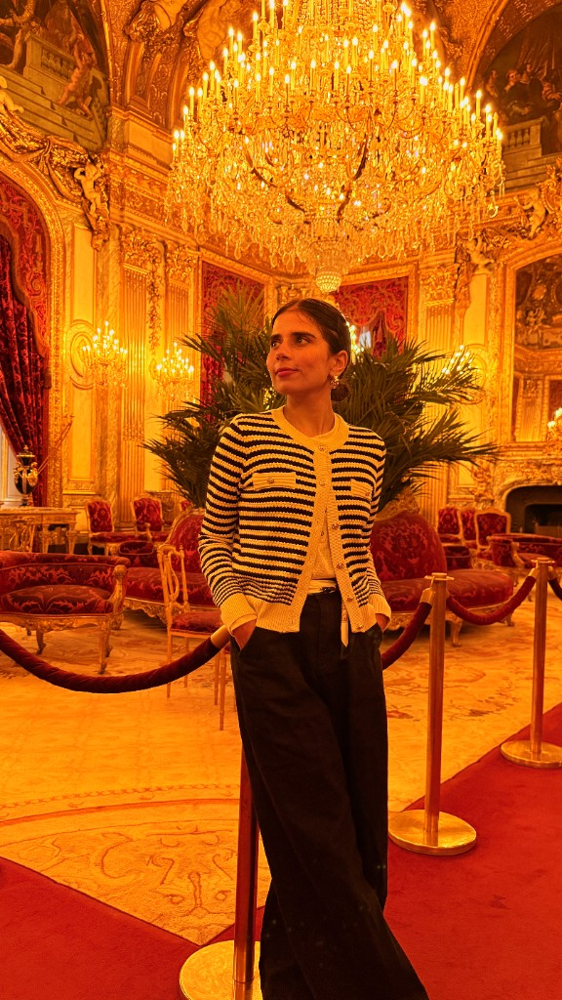
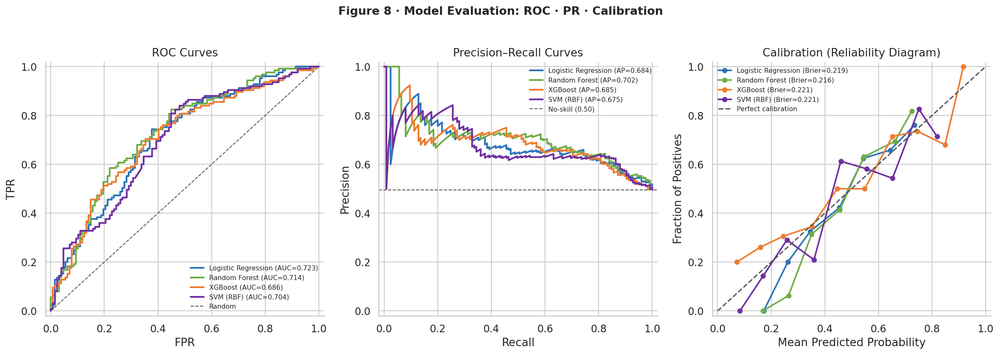
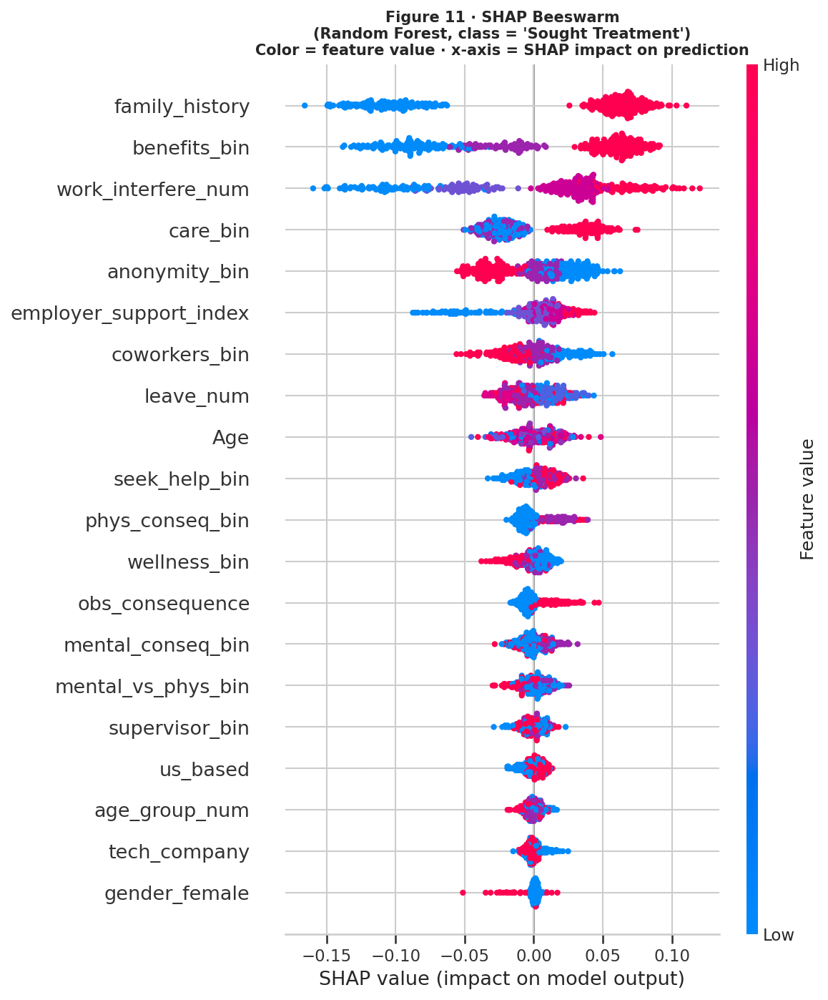
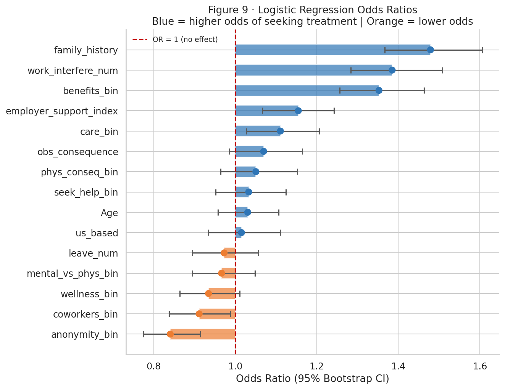
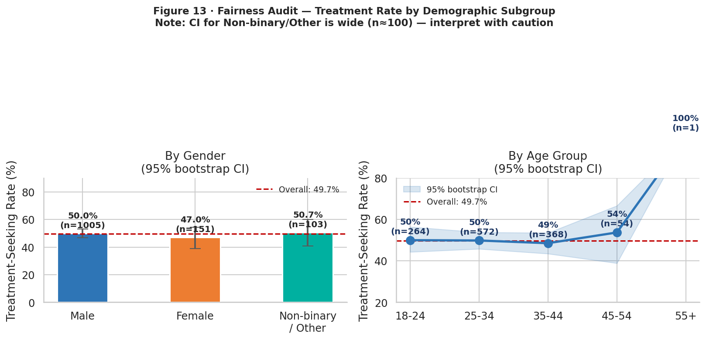
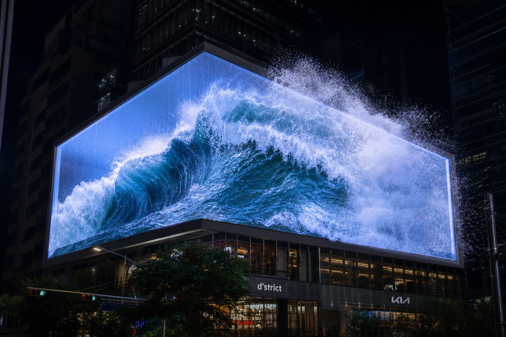
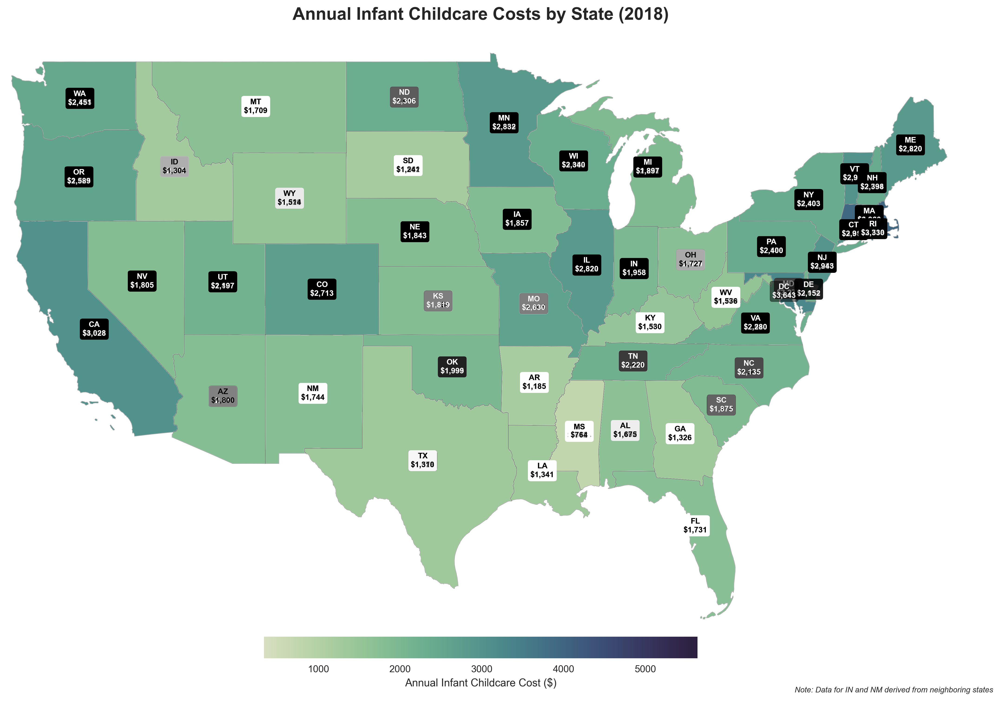
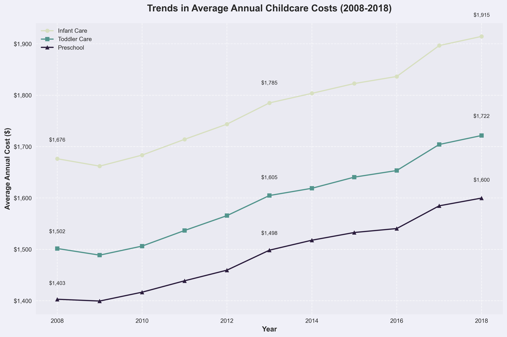
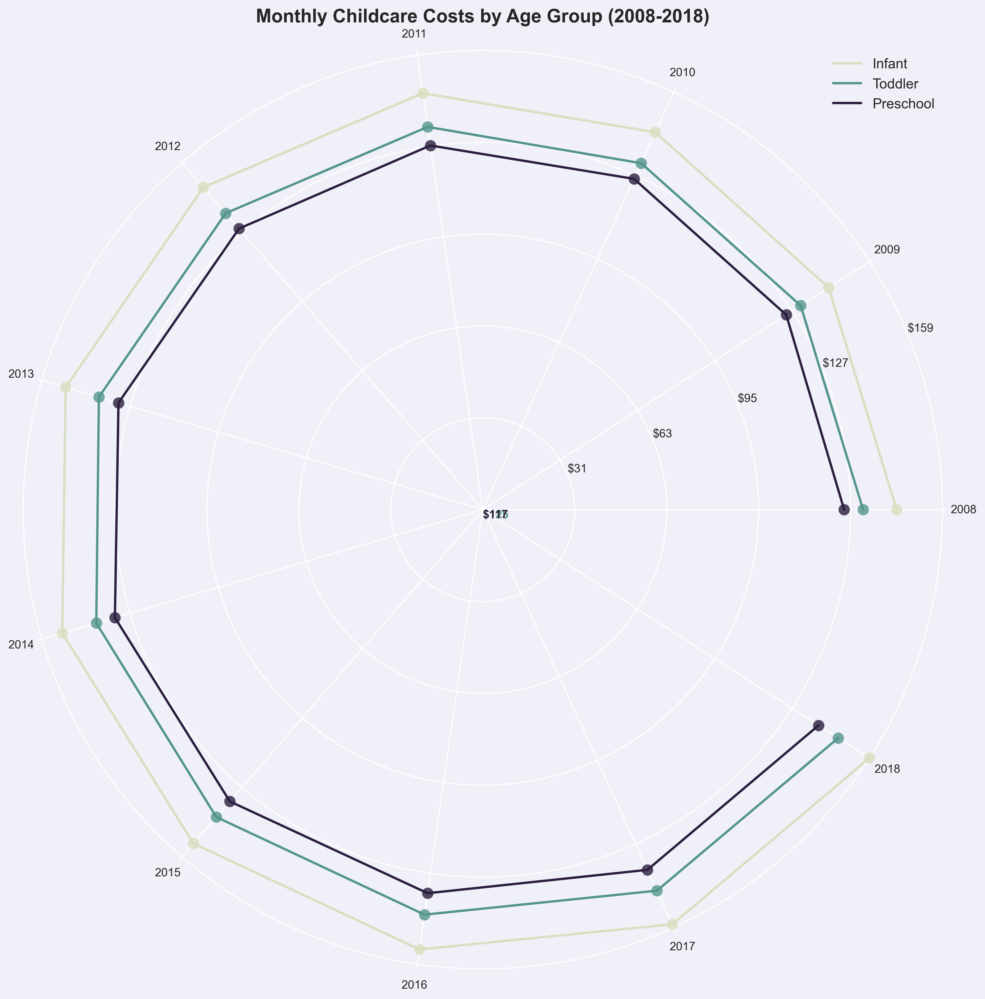
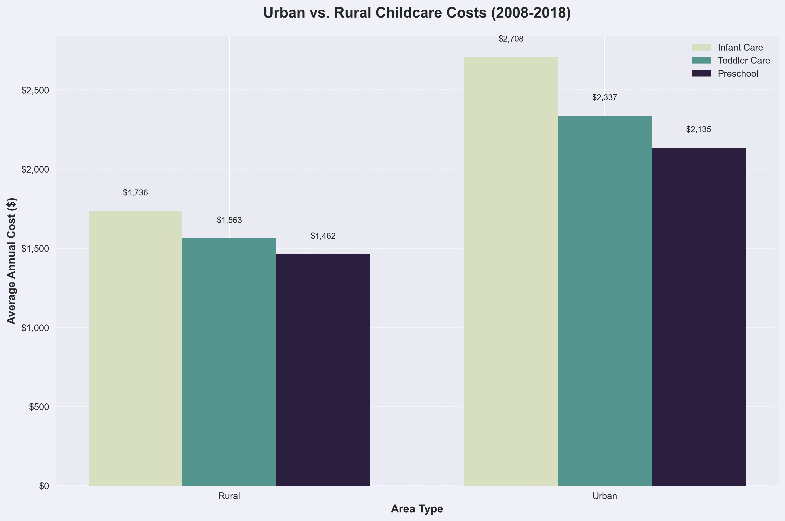

# Komal Shahid
### AI & Machine Learning Engineer

**M.S. Data Science · Bellevue University · GPA 4.0 · Class of 2025–2026**

---

## About Me

I'm a data scientist building intelligent systems that solve real human problems. Over two years at Bellevue University, I moved systematically from Python and statistics foundations through to production machine learning and ethical AI. My work focuses on three things: **impact** (projects that matter to people), **interpretability** (models you can understand and trust), and **rigor** (honest metrics, no inflated claims).

This portfolio documents the full MSDS program journey — 10 courses from DSC500 through DSC680 — plus three major capstone projects in mental health ML, AI content strategy, and computer vision.

---

## 🚀 Featured Projects

---

### 📌 Project 1 · Mental Health Treatment-Seeking Prediction
**DSC680 Capstone Project 1 | Classification + Fairness Audit | AUC 0.723**

<table>
<tr>
<td width="50%"></td>
<td width="50%"></td>
</tr>
<tr>
<td align="center">ROC · Precision-Recall · Calibration curves</td>
<td align="center">SHAP global feature importance</td>
</tr>
<tr>
<td width="50%"></td>
<td width="50%"></td>
</tr>
<tr>
<td align="center">Logistic regression odds ratios</td>
<td align="center">Fairness audit across subgroups</td>
</tr>
</table>

**What it does:** Analyzes the OSMI 2016 survey (N=1,259 tech workers) to predict who will seek mental health treatment — helping HR teams understand which organizational factors actually drive treatment-seeking behavior.

**Why it matters:** Mental health stigma and access barriers prevent people from getting help. This project provides evidence-based guidance on what employers can change to increase treatment rates.

**How it works:**
- Compared 4 classifiers: Logistic Regression, Random Forest, XGBoost, Neural Network
- Engineered a novel **Employer Support Index (ESI)** combining 6 workplace policy features
- Applied **SMOTE** to handle class imbalance in training
- Used **SHAP** to explain which features drive each prediction
- Ran a **fairness audit** across gender, age, and company size subgroups
- Winner: Logistic Regression (AUC=0.723) — chosen for interpretability over marginal gains

| Metric | Result |
|---|---|
| Best AUC | **0.723** |
| Dataset | OSMI 2016 · N = 1,259 |
| Novel Feature | Employer Support Index (ESI) |
| Deliverables | Notebook · White paper · Presentation · Q&A |

`Python` `scikit-learn` `XGBoost` `SHAP` `SMOTE` `Pandas` `Seaborn`

[📁 View Project](projects/project1-dsc680/) · [📄 White Paper](projects/project1-dsc680/milestone3_final/shahid_dsc680_project1_milestone3_whitepaper_FINAL.docx)

---

### 📌 Project 2 · AI-Driven Content Strategy Engine
**DSC680 Capstone Project 2 | NLP + Regression + ANOVA | R² = 0.271**

<table>
<tr>
<td width="50%"></td>
<td width="50%"></td>
</tr>
<tr>
<td align="center">OLS regression coefficients by content variable</td>
<td align="center">Topic × Format engagement heatmap</td>
</tr>
<tr>
<td width="50%"></td>
<td width="50%"></td>
</tr>
<tr>
<td align="center">Gradient boost permutation importance</td>
<td align="center">ANOVA — topic significance</td>
</tr>
</table>

**What it does:** Reverse-engineers what makes content win on Reddit — analyzing 12,000 posts to identify which topic, format, and hook style variables drive engagement. Then quantifies how much AI-conditioned content lifts performance.

**Why it matters:** Content creators and marketers spend huge budgets guessing what works. This project provides a statistically rigorous answer: AI-conditioned content delivers a measurable, reproducible engagement lift.

**How it works:**
- Collected and labeled 12K Reddit posts with engagement metrics (upvotes, comments, shares)
- Feature-engineered topic categories, format tags, and hook styles
- Ran **OLS regression** to identify significant predictors
- Validated with **Gradient Boosting** (permutation importance for cross-model confirmation)
- Applied **one-way ANOVA + Tukey HSD** post-hoc tests per content dimension
- Measured AI-conditioned content against a matched baseline sample

| Metric | Result |
|---|---|
| R² | **0.271** |
| Dataset | 12,000 Reddit posts |
| AI Engagement Lift | **+37%** (95% CI: +15%–+64%) |
| ANOVA Significance | p < .001 — topic, format, and hook type |

`Python` `OLS` `Gradient Boosting` `ANOVA` `Reddit API` `NLP`

[📁 View Project](projects/project2-content-strategy-engine/) · [📊 Interactive Infographic](https://ukomal.github.io/Komal-Shahid-DS-Portfolio/project2-infographic.html) · [📓 Final Notebook](projects/project2-content-strategy-engine/milestone3_final/shahid_dsc680_project2_notebook_FINAL.ipynb)

---

### 📌 Project 3 · Colorful Canvas — Anamorphic 3D Billboard Ads
**DSC680 Capstone Project 3 | Computer Vision + WebGL | Live Demo**

 Depth-driven radial warp rendering — anamorphic 3D billboard illusion

**What it does:** Creates the anamorphic 3D billboard illusion — where flat images appear to burst out of the screen — using depth-estimated radial warping. Works both as a Python pipeline and a live browser demo where anyone can upload their own image.

**Why it matters:** Anamorphic billboard ads command premium attention in outdoor advertising. This pipeline automates the perspective warp that would normally require manual 3D modeling work.

**How it works:**
- Python pipeline: OpenCV `remap()` applies depth-driven radial warp using synthetic or MiDaS neural depth maps
- Browser demo: Same geometry re-implemented in **Three.js + Canvas API** — no backend needed
- Upload any image, adjust warp strength in real time
- Optional **MiDaS/DPT** neural depth estimation for more realistic depth maps

`OpenCV` `NumPy` `PIL` `Three.js` `Canvas API` `MiDaS`

[📁 View Project](projects/project3-colorful-canvas/) · [🎮 Live Demo](projects/project3-colorful-canvas/index.html)

---

### 📌 Project 11 · U.S. Childcare Cost Analysis
**DSC640 — Data Presentation & Visualization**

<table>
<tr>
<td width="50%"></td>
<td width="50%"></td>
</tr>
<tr>
<td align="center">State-by-state childcare cost choropleth</td>
<td align="center">Cost trends over time by region</td>
</tr>
<tr>
<td width="50%"></td>
<td width="50%"></td>
</tr>
<tr>
<td align="center">Seasonal spiral visualization</td>
<td align="center">Urban vs rural cost comparison</td>
</tr>
</table>

**What it does:** An interactive data visualization case study analyzing the U.S. childcare cost crisis — mapping state-by-state costs, tracking trends over time, and correlating childcare costs with female labor force participation rates.

`Python` `R` `Plotly` `ggplot2` `Tableau`

[📁 View Project](projects/project11-dsc640/) · [📊 Interactive Dashboard](projects/project11-dsc640/milestone_final/enhanced-case-study.html)

---

## 📚 Full MSDS Program Course Portfolio

Each course below represents a distinct skill domain. Click any project to see the full deliverables.

| # | Course | What I Built | Key Skills |
|---|---|---|---|
| 01 | [**DSC500** — Intro to Data Science](projects/project4-dsc500/) | Program & career plan, data science lifecycle overview | Problem framing, research methods, ethics |
| 02 | [**DSC510** — Intro to Programming](projects/project5-dsc510/) | K-means clustering from scratch, Python capstone | Python, algorithms, data structures |
| 03 | [**DSC520** — Statistics for Data Science](projects/project6-dsc520/) | Mental health survey statistical analysis in R | Hypothesis testing, regression, inference, ggplot2 |
| 04 | [**DSC530** — Data Exploration & Analysis](projects/project7-dsc530/) | MovieLens EDA — rating distributions, genre correlations | EDA, PMF/CDF, correlation, ThinkStats2 |
| 05 | [**DSC540** — Advanced Data Management](projects/project8-dsc540/) | End-to-end data pipeline: ingestion → SQL → API integration | SQL, ETL, database design, API calls |
| 06 | [**DSC550** — Data Mining](projects/project9-dsc550/) | Classification + clustering on real dataset | Decision trees, k-means, association rules, scikit-learn |
| 07 | [**DSC630** — Predictive Analytics](projects/project10-dsc630/) | ARIMA sales forecasting for fashion retail | Time series, ARIMA/SARIMA, forecasting, evaluation |
| 08 | [**DSC640** — Data Visualization](projects/project11-dsc640/) | U.S. childcare cost interactive case study — 5 milestones | Plotly, R, Tableau, interactive dashboards, storytelling |
| 09 | [**DSC670** — Applied Machine Learning](projects/project12-dsc670/) | Notely — AI-powered note-taking app with LLM + semantic search | Streamlit, LLM APIs, embeddings, deployment |
| 10 | [**DSC680** — Applied Data Science Capstone](projects/project1-dsc680/) | Mental health ML + AI content strategy engine | End-to-end ML, NLP, SHAP, ANOVA, fairness |

---

## 🛠 Tech Stack

**Core languages:** Python (Expert) · R (Proficient) · SQL (Advanced)

**ML/AI:** Logistic Regression · XGBoost · LightGBM · Random Forest · Neural Networks · SHAP · SMOTE · ARIMA

**NLP:** BERT · Sentence Transformers · LLM APIs · Semantic Search · Feature Engineering

**Visualization:** Plotly · Tableau · ggplot2 · Seaborn · Matplotlib · Interactive Dashboards

**Engineering:** Docker · MLflow · Git · ETL Pipelines · SQLite · PostgreSQL · Streamlit

---

## 🎯 What Makes This Portfolio Different

**Human Impact First** — Every project addresses a real problem. Mental health stigma, childcare costs, content performance, visual advertising — these aren't toy datasets.

**Ethics-First ML** — Every model is audited for fairness across demographic groups, uncertainty is quantified with confidence intervals, and SHAP makes predictions interpretable.

**Full Program Coverage** — 10 courses documented end-to-end, from first Python script to production ML pipelines, showing the full arc of the MSDS program.

**Honest Evaluation** — Cross-validation, conservative metrics, documented limitations. No inflated numbers.

---

**M.S. Data Science · Bellevue University · GPA 4.0 · 2025–2026**

