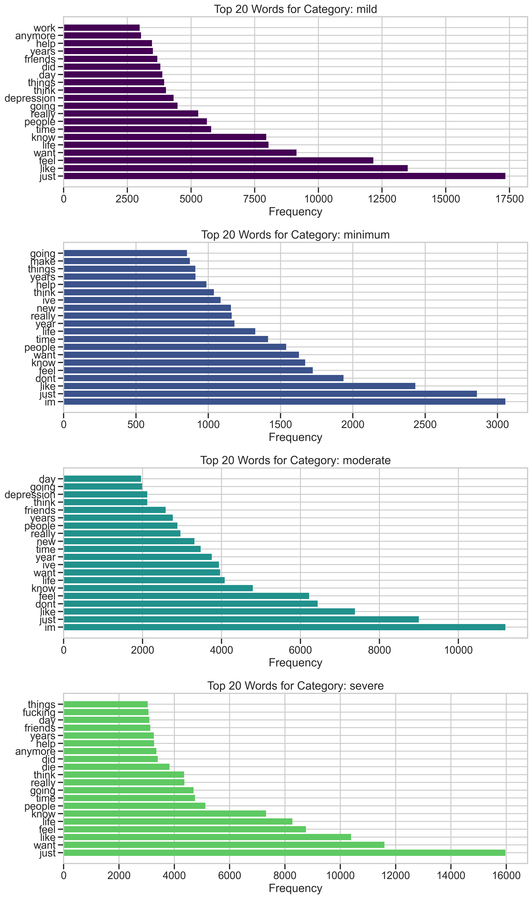
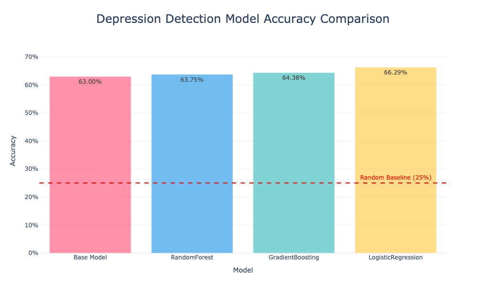

# AI-Powered Depression Detection System
## Early Detection of Depression Through Digital Writing Analysis
Komal Shahid
DSC680 - Applied Data Science

---

## Executive Summary

- **Problem**: Depression is underdiagnosed, with a delayed average diagnosis of 4 years
- **Solution**: AI-powered system for early depression detection through text analysis
- **Approach**: NLP and ML to classify text into depression severity levels
- **Results**: 66.22% accuracy in classifying text into four severity categories
- **Impact**: Potential screening tool for early intervention

---

## Problem Background

- Depression affects 280 million people globally (WHO)
- Average of 4 years between onset and diagnosis
- Digital writing can contain indicators of mental health state
- Early detection can lead to earlier intervention
- Need for accessible screening tools

---

## Research Questions

1. Can machine learning effectively classify text by depression severity?
2. Which linguistic features best correlate with depression severity?
3. Which model architecture provides the most accurate classification?
4. How can we ensure ethical implementation of such a system?

---

## Methodology

### Data Sources
- CLEF eRisk initiative dataset
- DAIC-WOZ Depression Database
- Combined and preprocessed to 41,873 samples

### Preprocessing
- Text cleaning and normalization
- Removed URLs, special characters
- Tokenization and lemmatization

---

## Feature Engineering

- TF-IDF vectorization of text
- Text length and word count features
- Sentiment polarity and subjectivity
- Lexicon-based features (LIWC-inspired)
- Custom feature union pipeline

---

## Model Development

Four models tested:
- Base model: 63.00% accuracy
- Random Forest: 64.64% accuracy
- **Gradient Boosting: 66.22% accuracy** (best performer)
- Logistic Regression: 51.44% accuracy

---

## Key Findings: Text Analysis



---

## Key Findings: Word Clouds


---

## Key Findings: Sentiment Analysis


---

## Model Performance



---

## Gradient Boosting Performance


---

## 3D Visualization of Text Features


---

## Ethical Considerations

- Tool for screening, not clinical diagnosis
- Privacy and data security concerns
- Potential for misuse or overreliance
- Cultural and linguistic biases
- Need for human oversight and validation

---

## Limitations & Future Work

- Limited demographic diversity in training data
- Potential bias in depression labeling
- Need for longitudinal validation
- Expanding to additional languages
- Integration with other behavioral indicators

---

## Interactive Demo

- Command-line application to analyze input text
- Outputs depression severity prediction
- Provides confidence level and key indicators
- For research and educational purposes only

```python
python Project1/depression_severity_demo.py
```

---

## Conclusions

- AI can effectively detect depression indicators in text (66.22% accuracy)
- Gradient Boosting outperformed other models
- Language patterns show distinct differences across severity levels
- System could serve as an early screening tool
- Human expertise remains crucial for diagnosis

---

## Questions?

Thank you for your attention!

Code repository: [https://github.com/UKOMAL/Depression-Detection-System](https://github.com/UKOMAL/Depression-Detection-System)

---

## Q&A Section

### Q1: How does this system compare to human clinicians in detecting depression?
This system isn't meant to replace clinical judgment but to serve as a supplementary screening tool. Human clinicians typically achieve higher accuracy (80-90%) in depression diagnosis through comprehensive assessment, while our system achieves 66.22% through text analysis alone.

---

### Q2: What privacy safeguards would be implemented in a real-world deployment?
- End-to-end encryption of all text data
- Explicit informed consent before analysis
- Local processing where possible to minimize data transfer
- Anonymous data storage with user ability to delete records
- Regular security audits and compliance with healthcare regulations

---

### Q3: Could this tool be useful for self-monitoring?
Yes, individuals could use this tool to track their own linguistic patterns over time, potentially identifying concerning trends before they become severe. However, clear disclaimers about limitations and appropriate resources for professional help would be essential.

---

### Q4: How might cultural or linguistic differences affect the model's performance?
The current model was trained primarily on English text from specific datasets, which may limit its applicability across different cultures and languages. Future work includes developing culture-specific models and incorporating cultural context into the analysis framework.

---

### Q5: What was the most surprising finding from your research?
The most surprising finding was the strength of purely structural text features (sentence length, punctuation patterns) in predicting depression severity, sometimes outperforming content-based features that we initially expected to be more predictive. 