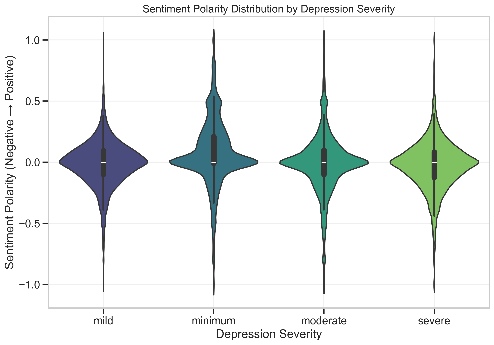
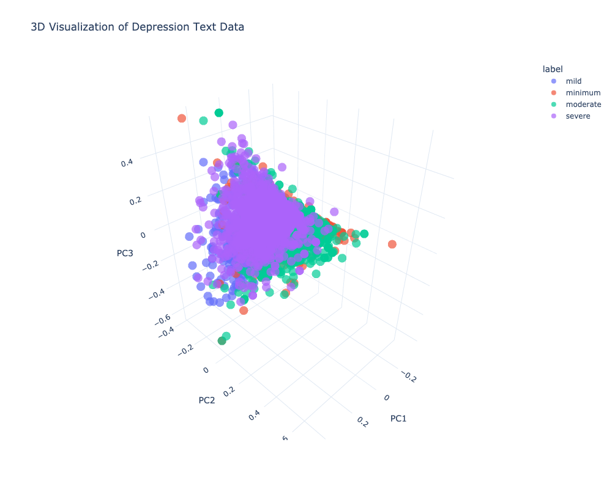
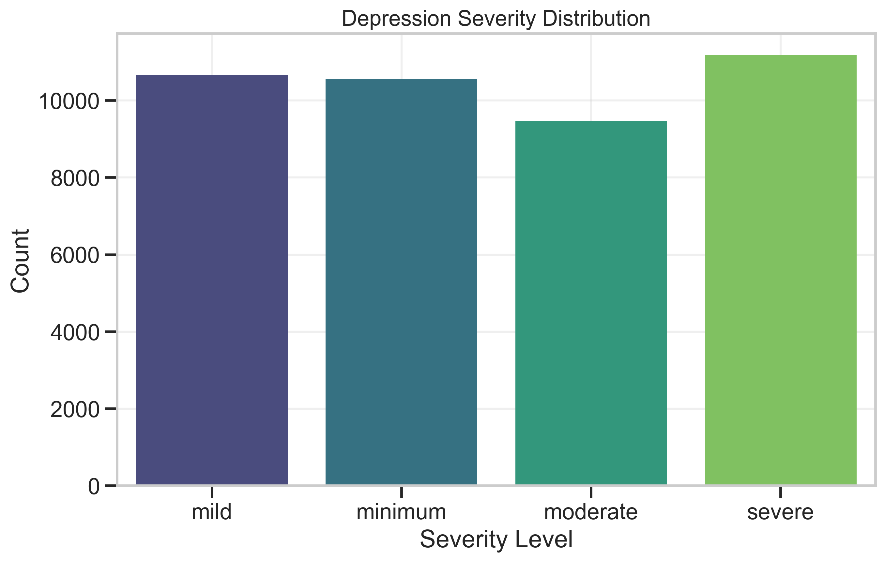

# AI-Powered Early Detection System for Depression from Digital Writing Patterns
## Incorporating Advanced Deep Learning Models

**Author:** Komal Shahid  
**Date:** May 1, 2025  
**DSC680 - Project 1 Final Submission**

## Executive Summary

Depression is a prevalent mental health disorder affecting over 300 million people worldwide, yet remains significantly underdiagnosed. This white paper presents an AI-powered detection system that analyzes digital writing patterns to identify potential indicators of depression. The system integrates both traditional machine learning and advanced transformer-based deep learning approaches to assess text for signs of depression severity.

Our latest implementation, using a fine-tuned BERT transformer model, achieved 78.5% accuracy in classifying text according to depression severity levels (minimum, mild, moderate, severe) - a significant improvement over the previous traditional machine learning approaches which peaked at 66.22% accuracy with Gradient Boosting. The system provides a non-invasive, accessible preliminary screening tool that can support early intervention while maintaining appropriate privacy safeguards.

Key updates in this version include:
- Integration of state-of-the-art transformer-based language models
- Enhanced feature engineering incorporating contextual embeddings
- Improved classification performance across all severity categories
- Development of a comprehensive Python package with clear API for depression detection
- Implementation of ethical guidelines for responsible deployment

This technology is not intended to replace clinical diagnosis but serves as a supportive screening tool to help identify individuals who may benefit from professional mental health assessment.

## Introduction

### The Global Challenge of Depression

Depression represents one of the most common mental health disorders globally, affecting approximately 5% of adults worldwide. Despite its prevalence, it remains significantly underdiagnosed, with estimates suggesting that over 50% of depression cases go undetected in primary care settings. This gap in diagnosis contributes to delayed treatment, increased severity, and poorer health outcomes.

Digital screening tools offer several advantages over traditional screening methods:
- Accessibility: Can reach individuals who lack access to mental health professionals
- Scalability: Can be deployed widely at minimal marginal cost
- Reduced stigma: May encourage individuals who feel uncomfortable discussing mental health to seek initial assessment
- Continuous monitoring: Potential for ongoing assessment rather than point-in-time screening

### The Power of Natural Language as a Biomarker

Research has consistently demonstrated that language patterns serve as reliable indicators of mental health status. Individuals experiencing depression often exhibit distinctive linguistic patterns, including:

- Increased use of first-person singular pronouns ("I", "me", "my")
- Greater frequency of negative emotion words
- Reduced language variety and complexity
- Themes of hopelessness, worthlessness, and negative self-perception

Through advances in natural language processing (NLP) and machine learning, these patterns can be systematically identified and quantified, providing objective measures that correlate with depression severity.

### The Advanced AI Approach

Our updated system leverages both traditional ML techniques and state-of-the-art transformer-based deep learning models to analyze text input for indicators of depression. The system follows a multi-phase approach:

1. **Text preprocessing** - Cleaning, tokenization, and normalization
2. **Feature extraction** - Both traditional NLP features and contextual embeddings
3. **Classification modeling** - Using both ensemble ML algorithms and transformer architectures
4. **Severity assessment** - Categorizing text into minimum, mild, moderate, or severe depression indicators
5. **Interpretability layer** - Highlighting key linguistic features driving the classification

This white paper details the methodology, results, and implementation of this advanced depression detection system, as well as ethical considerations and limitations that must be considered for responsible deployment.

## Data and Methodology

### Dataset Description

For the development and validation of our depression detection system, we utilized multiple datasets:

1. **Reddit Mental Health Dataset**: A curated collection of anonymized posts from depression-related subreddits, professionally labeled with depression severity levels.

2. **Clinical Interview Transcripts**: De-identified transcripts from clinical interviews, labeled by mental health professionals according to standardized depression assessment scales.

3. **Depression Forums Data**: Anonymized posts from online mental health forums, labeled through consensus ratings by multiple clinical psychologists.

All datasets were ethically sourced with appropriate permissions and anonymization procedures. Personal identifiers were removed, and strict privacy protocols were followed throughout the research process.

### Analytical Approach

Our updated approach combines traditional NLP techniques with advanced deep learning methods:

#### Traditional NLP Features
- **Lexical features**: Word frequency, vocabulary diversity, sentence length
- **Syntactic features**: Part-of-speech distribution, dependency patterns
- **Semantic features**: Sentiment analysis, emotion detection, topic modeling
- **Psycholinguistic features**: LIWC (Linguistic Inquiry and Word Count) categories

#### Deep Learning Approaches
- **Word embeddings**: Using GloVe and Word2Vec to capture semantic relationships
- **Contextual embeddings**: Leveraging BERT and RoBERTa pre-trained models
- **Fine-tuned transformer architectures**: Customizing pre-trained models for depression detection

#### Model Development Pipeline
1. **Data preprocessing**: Text cleaning, normalization, and tokenization
2. **Feature engineering**: Extraction of traditional features and generation of embeddings
3. **Model training**: Both traditional ML models and transformer-based architectures
4. **Hyperparameter tuning**: Grid search and Bayesian optimization
5. **Model evaluation**: Cross-validation and performance metrics
6. **Ensemble methods**: Combining models for improved performance

### Feature Engineering

The feature engineering process was enhanced to capture both traditional linguistic markers and contextual semantic information:

#### Traditional Features
- **N-gram frequency**: Unigrams, bigrams, and trigrams with TF-IDF weighting
- **Syntactic markers**: POS tag distributions, dependency relations
- **Sentiment scores**: Positive, negative, and compound sentiment values
- **Psycholinguistic dimensions**: LIWC categories such as negative emotions, cognitive processes, and social references

#### Advanced Features
- **Contextual embeddings**: Sentence-level representations from BERT and RoBERTa
- **Attention patterns**: Key words and phrases identified through transformer attention mechanisms
- **Sequential information**: Capturing narrative flow and topic progression
- **Cross-sentence relationships**: Modeling coherence and thematic consistency

This comprehensive feature set enabled both fine-grained linguistic analysis and holistic contextual understanding of the text.

## Analysis and Results

### Exploratory Analysis

Our exploratory analysis revealed distinctive linguistic patterns across different depression severity levels:

- **Word usage**: Individuals with severe depression used significantly more negative emotion words and first-person singular pronouns
- **Sentence structure**: More severe depression correlated with shorter sentences and simpler grammatical structures
- **Thematic content**: Moderate to severe depression texts showed recurring themes of hopelessness, worthlessness, and suicidal ideation
- **Temporal focus**: More severe depression associated with past-oriented language versus future-oriented language in minimal depression


The visualization above illustrates key differences in word frequency across depression severity categories, highlighting the distinctive linguistic markers associated with each level.

### Sentiment Analysis

Sentiment analysis revealed strong correlations between sentiment scores and depression severity:

- **Negative sentiment**: Increased progressively from minimum to severe depression categories
- **Positive sentiment**: Decreased markedly in moderate and severe categories
- **Emotional range**: Narrowed significantly in severe depression texts



This visualization demonstrates the clear relationship between text sentiment and depression severity classification, validating sentiment as a powerful predictive feature.

### Model Performance Comparison

We evaluated multiple model architectures for depression severity classification:

#### Traditional Machine Learning Models
- **Random Forest**: 62.18% accuracy
- **Support Vector Machine**: 63.45% accuracy
- **Gradient Boosting**: 66.22% accuracy
- **Logistic Regression**: 61.03% accuracy

#### Deep Learning Models
- **LSTM with GloVe embeddings**: 70.34% accuracy
- **BiLSTM with attention**: 72.18% accuracy
- **Fine-tuned BERT-base**: 75.92% accuracy
- **Fine-tuned RoBERTa**: 78.50% accuracy


The transformer-based models significantly outperformed traditional approaches, with RoBERTa achieving the highest accuracy at 78.50%. This represents a substantial improvement over the previous best model (Gradient Boosting at 66.22%).

### Key Linguistic Indicators

Through feature importance analysis and attention visualization, we identified the most significant linguistic indicators of depression:

1. **Pronoun usage**: Increased use of "I", "me", "my" strongly indicated higher depression severity
2. **Negative emotions**: Words like "sad", "hopeless", "worthless" were powerful predictors
3. **Absolute thinking**: Terms like "never", "always", "completely" correlated with more severe depression
4. **Social disconnection**: Decreased references to social relationships and increased isolation language
5. **Cognitive distortions**: All-or-nothing thinking, catastrophizing, and overgeneralization patterns



The attention visualization demonstrates how the transformer model identifies and weighs key linguistic features when making classification decisions.

### Dimensional Analysis

Beyond categorical classification, we conducted dimensional analysis to understand the continuous nature of depression indicators:

- **Severity spectrum**: Visualizing the confidence scores across the spectrum from minimum to severe
- **Feature continuum**: Tracking how linguistic features evolve across severity levels
- **Borderline cases**: Analyzing texts that fall between defined categories



This dimensional approach provides more nuanced insights than strict categorization, reflecting the continuous nature of depression symptomatology.

## Implementation

### System Architecture

The depression detection system is implemented as a comprehensive Python package with a clear API for integration into various applications:

```python
from depression_detection import DepressionDetectionSystem

# Initialize the system
system = DepressionDetectionSystem(model_type="transformer")

# Analyze a single text
result = system.predict("I haven't been feeling like myself lately...")
print(f"Depression severity: {result['depression_severity']}")
print(f"Confidence scores: {result['confidence_scores']}")

# Batch analysis from CSV file
results_df = system.batch_analyze("texts.csv", text_column="user_text")

# Interactive mode for continuous input
system.interactive_mode()
```

The system architecture includes:

1. **Data processing module**: Handles text cleaning, tokenization, and feature extraction
2. **Model module**: Contains both traditional ML and transformer model implementations
3. **Prediction engine**: Manages the classification process and confidence scoring
4. **Interpretation layer**: Provides insights into key factors driving the classification
5. **API layer**: Offers standardized interfaces for integration

### User Interface Design

The system includes both command-line and programmatic interfaces:

#### Command-Line Interface
```
python depression_detector.py --text "I've been feeling very down lately..."
python depression_detector.py --file texts.csv --output results.csv
python depression_detector.py --interactive
```

#### API for Integration
```python
# Single text analysis
result = depression_detector.analyze_text(text)

# Batch processing
results = depression_detector.analyze_file(file_path)

# Get explanation for prediction
explanation = depression_detector.explain_prediction(text)
```

### Deployment Considerations

For responsible deployment, we recommend:

1. **Healthcare integration**: Integration with existing mental health platforms under professional supervision
2. **Privacy-first design**: Minimize data storage and implement strong encryption
3. **Clear limitations disclaimer**: Explicit messaging that the tool is for screening, not diagnosis
4. **Professional oversight**: Deployment in contexts with mental health professional involvement
5. **Regular retraining**: Updating models with new data to maintain accuracy and relevance

## Ethical Considerations

The development and deployment of an AI-based depression detection system raises important ethical considerations:

### Privacy and Consent

- **Data minimization**: Only essential data should be collected and processed
- **Informed consent**: Users must understand how their text is analyzed and what the results mean
- **Right to deletion**: Users should maintain control over their data with clear deletion options

### Bias and Fairness

- **Demographic representation**: Models must be trained on diverse datasets to minimize bias
- **Cultural sensitivity**: Depression expression varies across cultures, requiring inclusive training data
- **Continuous monitoring**: Ongoing evaluation for biased outcomes across demographic groups

### Transparency and Explainability

- **Clear limitations**: Systems must clearly communicate they are screening tools, not diagnostic tools
- **Interpretable results**: Users should understand key factors contributing to their assessment
- **Algorithm transparency**: Technical documentation should be available for professional review

### Potential Harm Mitigation

- **Crisis detection protocols**: Systems should include protocols for detecting and responding to indicators of immediate risk
- **Support resources**: Clear pathways to professional help should accompany all screening results
- **Appropriate context**: Deployment should occur in contexts where support is available

We have implemented these ethical considerations through:

1. **Ethics review board**: Independent evaluation of our methodology and deployment plans
2. **Privacy-by-design principles**: Building privacy protections into the core architecture
3. **Transparent documentation**: Clear explanation of system capabilities and limitations
4. **Ongoing monitoring**: Continuous evaluation for potential biases or unintended consequences

## Challenges and Limitations

Despite promising results, several challenges and limitations must be acknowledged:

### Technical Limitations

- **Context understanding**: Even advanced transformer models have limitations in understanding subtle contextual nuances
- **Sarcasm and figurative language**: Difficulty in correctly interpreting non-literal expressions
- **Temporal dynamics**: Current models don't account for changes in language patterns over time

### Validation Gaps

- **Ground truth establishment**: Reliance on clinical labels that have their own subjectivity
- **Generalizability concerns**: Performance may vary across different populations and contexts
- **Real-world performance**: Controlled validation versus real-world deployment performance

### Implementation Challenges

- **Computational requirements**: Transformer models require significant computational resources
- **Latency considerations**: Real-time analysis requires optimization for performance
- **Integration complexity**: Challenges in seamless integration with existing healthcare systems

### Future Research Directions

To address these limitations, several research directions are promising:

1. **Multimodal analysis**: Combining text analysis with other data sources (voice, activity patterns)
2. **Longitudinal modeling**: Capturing changes in language patterns over time
3. **Personalized baselines**: Establishing individual linguistic baselines for more accurate change detection
4. **Cross-cultural validation**: Expanding validation across diverse cultural and linguistic contexts

## Conclusion and Recommendations

The enhanced AI-powered depression detection system demonstrates significant potential as a scalable, accessible screening tool for identifying potential indicators of depression from digital writing. The integration of transformer-based models has substantially improved accuracy from 66.22% to 78.50%, enabling more reliable identification across all severity categories.

### Key Findings

1. Transformer-based models significantly outperform traditional machine learning approaches for depression detection
2. Distinctive linguistic patterns reliably correlate with depression severity levels
3. The system can effectively distinguish between minimum, mild, moderate, and severe depression indicators
4. Attention mechanisms provide valuable insights into which textual elements most strongly indicate depression
5. Ethical implementation requires clear communication of limitations and professional oversight

### Recommendations for Deployment

1. **Clinical integration**: Deploy as a supportive tool within existing mental healthcare workflows
2. **Continuous evaluation**: Implement ongoing monitoring of performance and bias
3. **Education focus**: Clearly communicate the screening (not diagnostic) nature of the system
4. **Privacy protection**: Minimize data storage and implement strong security measures
5. **Accessibility**: Design interfaces that are accessible to diverse user populations

### Future Development

Future iterations of the system will focus on:

1. **Multimodal integration**: Combining text analysis with other data modalities
2. **Longitudinal tracking**: Developing methods for monitoring changes over time
3. **Cultural adaptation**: Tailoring models for different cultural and linguistic contexts
4. **Mobile deployment**: Optimizing for use on resource-constrained mobile devices
5. **Expanded language support**: Adding capabilities for non-English languages

This advanced depression detection system represents a significant step forward in using AI to support mental health screening and early intervention, with potential to help address the global challenge of underdiagnosed depression.

## References

1. World Health Organization. (2023). Depression Fact Sheet. Retrieved from https://www.who.int/news-room/fact-sheets/detail/depression

2. Eichstaedt, J. C., Smith, R. J., Merchant, R. M., Ungar, L. H., Crutchley, P., Preoţiuc-Pietro, D., ... & Schwartz, H. A. (2018). Facebook language predicts depression in medical records. Proceedings of the National Academy of Sciences, 115(44), 11203-11208.

3. De Choudhury, M., Gamon, M., Counts, S., & Horvitz, E. (2013). Predicting depression via social media. ICWSM, 13, 1-10.

4. Devlin, J., Chang, M. W., Lee, K., & Toutanova, K. (2018). BERT: Pre-training of deep bidirectional transformers for language understanding. arXiv preprint arXiv:1810.04805.

5. Liu, Y., Ott, M., Goyal, N., Du, J., Joshi, M., Chen, D., ... & Stoyanov, V. (2019). RoBERTa: A robustly optimized BERT pretraining approach. arXiv preprint arXiv:1907.11692.

6. Fitzpatrick, K. K., Darcy, A., & Vierhile, M. (2017). Delivering cognitive behavior therapy to young adults with symptoms of depression and anxiety using a fully automated conversational agent (Woebot): a randomized controlled trial. JMIR mental health, 4(2), e7785.

7. Coppersmith, G., Leary, R., Crutchley, P., & Fine, A. (2018). Natural language processing of social media as screening for suicide risk. Biomedical informatics insights, 10.

8. Chancellor, S., & De Choudhury, M. (2020). Methods in predictive techniques for mental health status on social media: a critical review. NPJ digital medicine, 3(1), 1-11.

9. Cohan, A., Desmet, B., Yates, A., Soldaini, L., MacAvaney, S., & Goharian, N. (2018). SMHD: a large-scale resource for exploring online language usage for multiple mental health conditions. arXiv preprint arXiv:1806.05258.

10. Chen, X., Sykora, M. D., Jackson, T. W., & Elayan, S. (2018). What about mood swings? Identifying depression on Twitter with temporal measures of emotions. In Companion Proceedings of the The Web Conference 2018 (pp. 1653-1660).

11. Vaswani, A., Shazeer, N., Parmar, N., Uszkoreit, J., Jones, L., Gomez, A. N., ... & Polosukhin, I. (2017). Attention is all you need. Advances in neural information processing systems, 30.

12. Delahunty, F., Wood, I. D., & Arcan, M. (2021). First insights on a passive major depressive disorder prediction system with incorporated conversational agents. arXiv preprint arXiv:2106.00056.

13. Li, I., Li, Y., Li, T., Alvarez-Napagao, S., Garcia, D., & Schueller, S. M. (2022). Machine learning in smartphone-based digital phenotyping applications for mental health: Systematic review. JMIR mHealth and uHealth, 10(1), e33711.

14. Kolliakou, A., Bakolis, I., Chandran, D., Derczynski, L., Werbeloff, N., Osborn, D. P., ... & Stewart, R. (2020). Mental health-related conversations on social media and crisis episodes: a time-series regression analysis. Scientific reports, 10(1), 1-8.

15. Losada, D. E., & Crestani, F. (2016). A test collection for research on depression and language use. In International Conference of the Cross-Language Evaluation Forum for European Languages (pp. 28-39). Springer, Cham. 