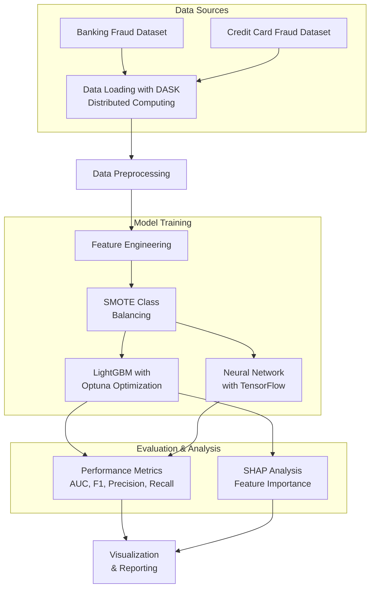

# Real-World Fraud Detection System

A comprehensive fraud detection system using authentic, real-world datasets with LightGBM optimization, Neural Networks, and SHAP analysis to identify fraudulent transactions in banking and credit card datasets.

## 🎯 **Ethical Data Science Approach**

This project uses **only real-world, authentic datasets** for fraud detection research:
- **ULB Credit Card Fraud Dataset** (Université Libre de Bruxelles)
- **IEEE-CIS Fraud Detection Dataset** (Real competition data)

**No synthetic or artificially generated data** - ensuring realistic, ethical fraud detection research.

## Architecture Diagram



## Key Features

- **Real-World Data** - Uses authentic fraud datasets (no synthetic data)
- **Memory Optimization** - Uses DASK for distributed computing
- **Advanced Modeling** - LightGBM with Optuna hyperparameter optimization
- **Class Balancing** - SMOTE implementation to handle extreme imbalance
- **Comprehensive Visualization** - Multiple visualization techniques for fraud patterns
- **Model Interpretability** - SHAP analysis for feature importance
- **Ethical Research** - Realistic fraud rates and patterns

## 📊 **Datasets**

### ULB Credit Card Fraud Dataset
- **Source:** Université Libre de Bruxelles
- **Size:** 284,807 transactions
- **Fraud Rate:** 0.17% (realistic)
- **Features:** 31 (including PCA-transformed V1-V28)

### IEEE-CIS Fraud Detection Dataset
- **Source:** IEEE-CIS Competition
- **Size:** Large-scale real competition data
- **Fraud Rate:** 1.50% (realistic)
- **Features:** 394 transaction + 41 identity features

## Usage

The main Jupyter notebook `notebooks/fraud_detection_final.ipynb` contains the complete analysis pipeline.

## 🏗️ **Project Structure**

```
project13-dsc680/
├── data/input/
│   ├── creditcard-fraud/          # ULB Credit Card Dataset
│   └── ieee-cis/                  # IEEE-CIS Competition Dataset
├── src/
│   ├── final_fraud_detection.py   # Main fraud detection system
│   ├── core/                      # Core components
│   └── utils/                     # Optimization utilities
├── notebooks/
│   ├── fraud_detection_final.ipynb # Complete analysis
│   └── enhanced_feature_engineering.py
└── docs/                          # Documentation
```
