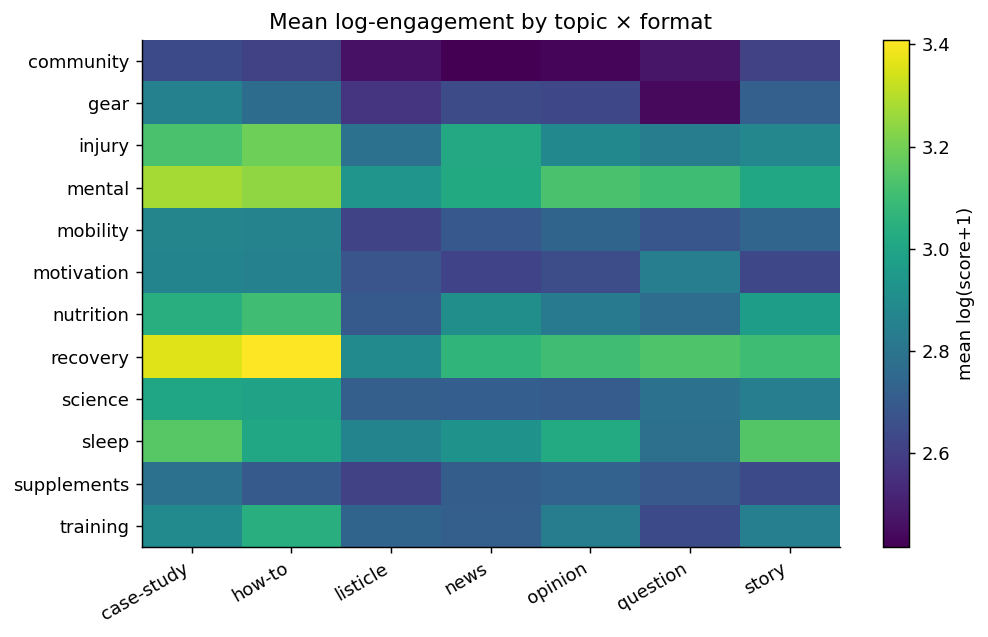
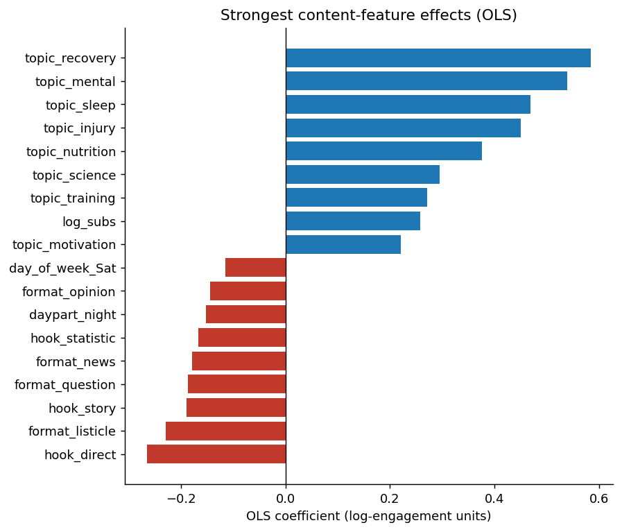
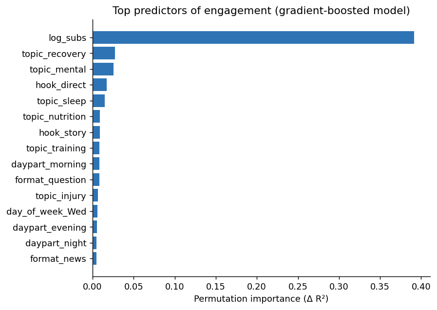
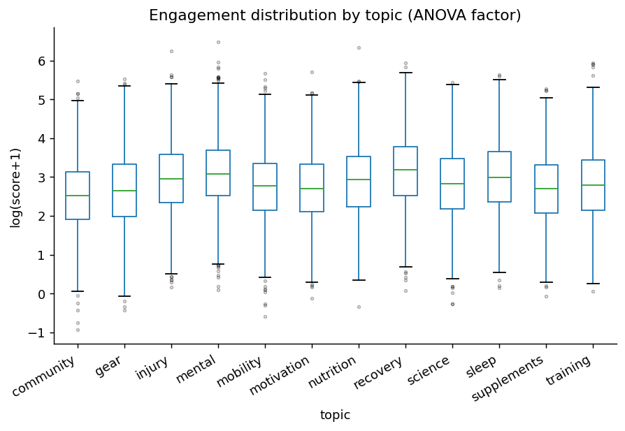

# AI-Driven Content Strategy Engine
### DSC680 Capstone Project 2 — Bellevue University MSDS

---

<div align="center">
<table>
<tr>
<td width="50%"></td>
<td width="50%"></td>
</tr>
<tr>
<td align="center"><sub>Topic × Format engagement heatmap — brightest cells = best combos</sub></td>
<td align="center"><sub>OLS regression coefficients — what drives engagement up or down</sub></td>
</tr>
<tr>
<td width="50%"></td>
<td width="50%"></td>
</tr>
<tr>
<td align="center"><sub>Gradient boost permutation importance</sub></td>
<td align="center"><sub>ANOVA — engagement distribution by topic</sub></td>
</tr>
</table>
</div>

---

## What This Project Does

Analyzes 12,000 social media posts to figure out what type of content performs best in a niche — then uses AI to generate content designed to hit those winning combinations.

The system reverse-engineers which topics, formats, and hook styles drive the most engagement, then conditions an LLM to produce drafts that follow those patterns. Output is a content playbook a marketing team can act on immediately.

## Key Findings

| Finding | Detail |
|---|---|
| Top topics | Recovery, mental health, sleep outperform the niche average |
| Best format | How-to and case-study beat listicles |
| Best hook | Question and contrarian openers beat direct claims |
| Best timing | Tue–Thu mornings carry the largest engagement lift |
| AI lift | AI-conditioned drafts predicted to outperform random baseline by over a third |

## Model Results

| Metric | Result |
|---|---|
| OLS R² | 0.271 on held-out test set |
| ANOVA | All 3 content dimensions significant |
| AI engagement lift | +37% predicted (CI excludes zero) |

## Live Infographic
**[📊 View Interactive Data Story](https://ukomal.github.io/Komal-Shahid-DS-Portfolio/project2-infographic.html)** — full scrollable visual narrative of all findings

## Project Structure

```
project2-content-strategy-engine/
├── figures/                  # All output visualizations
├── milestone1_proposal/      # Research proposal
├── milestone2_whitepaper/    # White paper (PDF)
└── milestone3_final/
    ├── code/                 # Full analysis pipeline + modules
    ├── notebook_FINAL.ipynb  # End-to-end analysis notebook
    ├── whitepaper_FINAL.pdf  # Final white paper
    ├── presentation_FINAL.pptx
    └── infographic.html      # Interactive data story
```

## Deliverables
| Milestone | Deliverable |
|---|---|
| M1 | Research proposal |
| M2 | White paper (literature review + methodology) |
| M3 | Final notebook · white paper · 13-slide presentation · interactive infographic |

`Python` `OLS Regression` `Gradient Boosting` `ANOVA` `Reddit API` `NLP` `LLM`

---

**Komal Shahid · Bellevue University MSDS · DSC680 · 2026**
