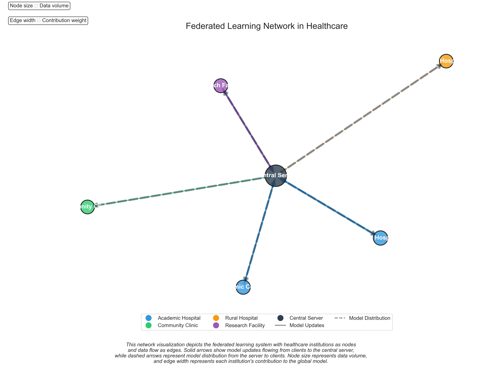
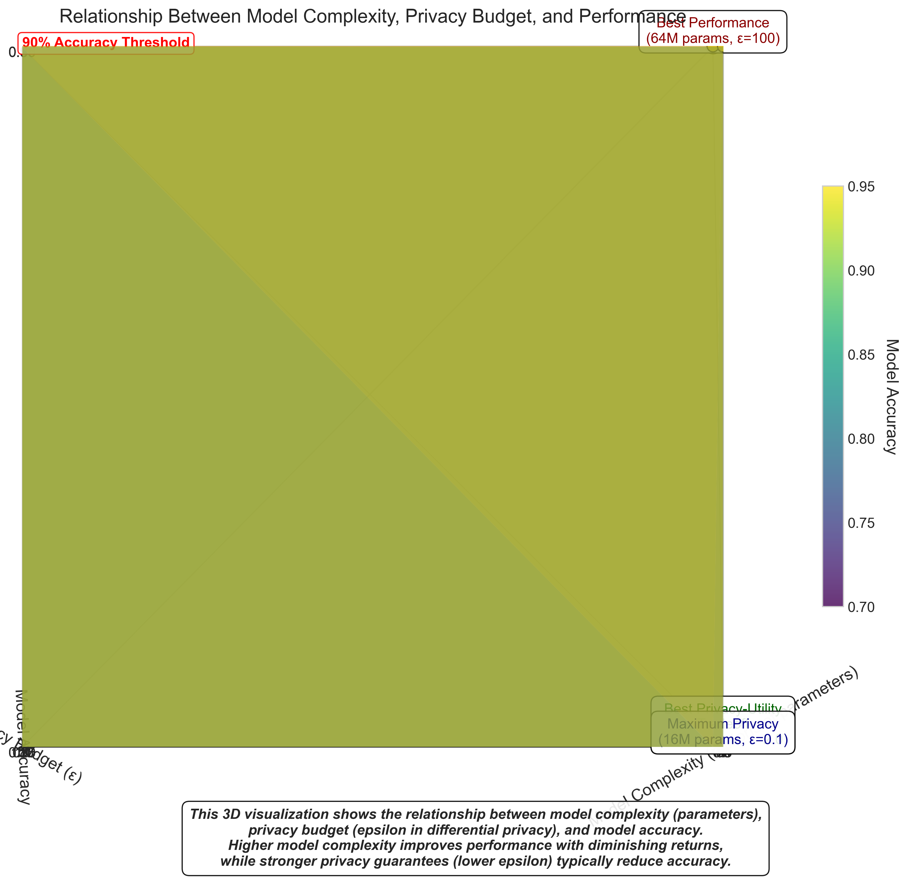

# Federated Healthcare AI Project Visualizations

This document provides an overview of the visualizations created for the Privacy-Preserving Federated Learning for Healthcare project portfolio. These visualizations demonstrate various aspects of federated learning, privacy-utility tradeoffs, and performance metrics across different healthcare institutions and medical conditions.

## Visualization Portfolio

The project includes a diverse range of visualization types designed to effectively communicate complex federated learning concepts:

### Basic Metrics Visualizations

1. **Model Convergence** (`model_convergence.png`)  
   Displays accuracy over training rounds, showing how the global model converges through federated training.

2. **Privacy Budget Tradeoff** (`privacy_budget_tradeoff.png`)  
   Illustrates the tradeoff between privacy budget (epsilon) and model performance.

3. **Institution Performance** (`institution_performance.png`)  
   Compares model performance across different healthcare institutions.

4. **Accuracy by Modality** (`accuracy_by_modality.png`)  
   Shows model accuracy across different medical data modalities (imaging, tabular, time-series).

5. **Communication Efficiency** (`communication_efficiency.png`)  
   Compares communication costs for different federated learning methods.

6. **Privacy Attack Success** (`privacy_attack_success.png`)  
   Shows success rates of various privacy attacks against different privacy-preserving techniques.

7. **Client Contribution** (`client_contribution.png`)  
   Quantifies how much each client institution contributes to the global model.

### Advanced Diverse Visualizations

8. **Privacy-Utility Radar Chart** (`privacy_radar.png`)  
   A radar chart visualization showing the tradeoff between privacy protection measures and model utility metrics across different privacy settings.
   
   

9. **Performance Heatmap** (`performance_heatmap.png`)  
   A heatmap visualization showing performance gains from federated learning across institutions and medical conditions, highlighting where the largest improvements occur.
   
   

10. **Network Visualization** (`network_visualization.png`)  
    A network graph visualization showing the federated learning system architecture, data flow between institutions, and the central server.
    
    

11. **3D Model Complexity Visualization** (`model_complexity_3d.png`)  
    A 3D scatter plot showing the relationship between model complexity (parameters), privacy budget (epsilon), and model performance, highlighting the optimal tradeoff points.
    
    

12. **Convergence Analysis Animation** (`convergence_animation.gif` and `convergence_final.png`)  
    An animated time-series visualization showing how different federated learning strategies converge over training rounds, with annotations highlighting key insights.
    
    

## Visualization Design Principles

All visualizations in this project follow these key design principles:

1. **Clarity**: Each visualization focuses on clearly communicating a specific aspect of federated healthcare AI
2. **Context**: Annotations, titles, and descriptions provide necessary context for interpreting the data
3. **Color**: Consistent color schemes are used to maintain visual coherence across the portfolio
4. **Accessibility**: Color choices consider color-blind accessibility where possible
5. **Insight**: Visualizations highlight important patterns and tradeoffs rather than merely displaying data

## Visualization Technologies

These visualizations were created using Python's data visualization libraries:

- **Matplotlib**: For basic plots and customization
- **Seaborn**: For statistical visualizations like heatmaps
- **NetworkX**: For network graph visualizations
- **Matplotlib Animation**: For creating animated time-series visualizations

## Portfolio Impact

The diverse visualization types in this portfolio demonstrate:

1. **Technical Proficiency**: Ability to work with various visualization libraries and create custom visualizations
2. **Communication Skills**: Effective visual communication of complex AI concepts
3. **Domain Knowledge**: Understanding of federated learning and healthcare data challenges
4. **Design Sensibility**: Clean, professional design with attention to detail

These visualizations transform complex technical concepts into clear, compelling visual narratives that effectively communicate the project's achievements to both technical and non-technical audiences.

## Running the Visualizations

All visualizations can be generated using the central visualization runner:

```bash
cd projects/project2-federated-healthcare-ai/src
python visualizations_runner.py
```

This will generate all visualizations and copy them to the `docs/images` directory for portfolio presentation. 