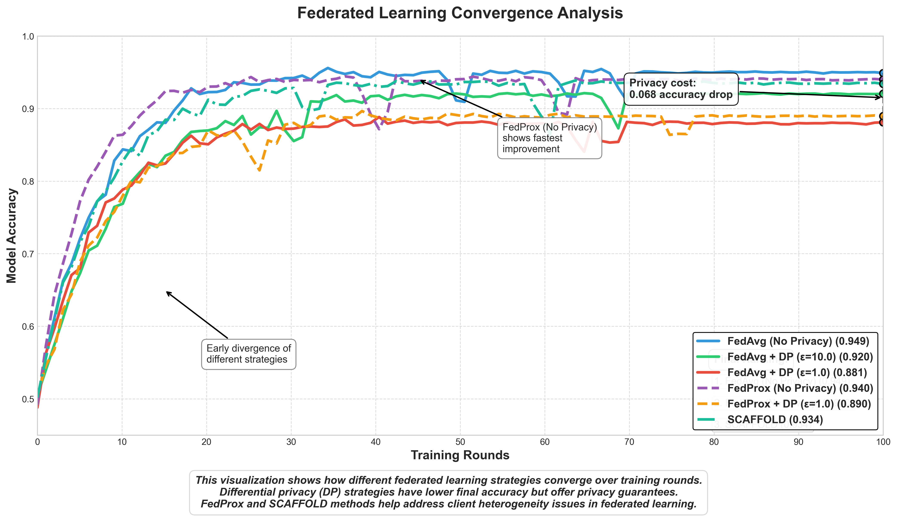
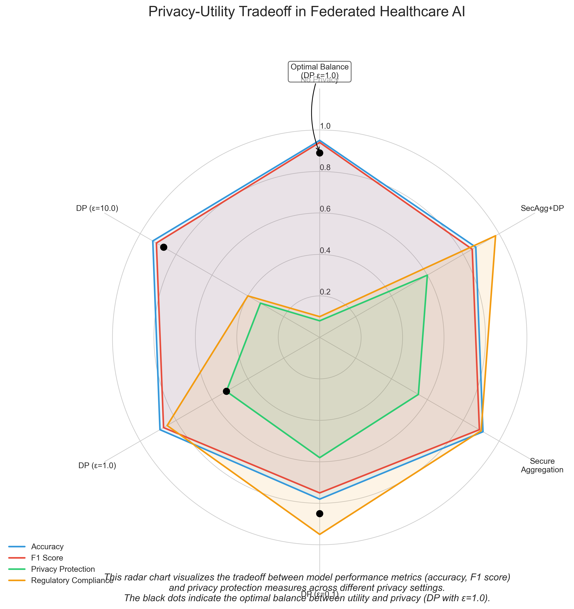
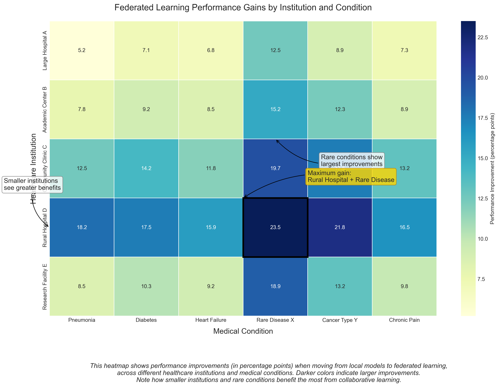
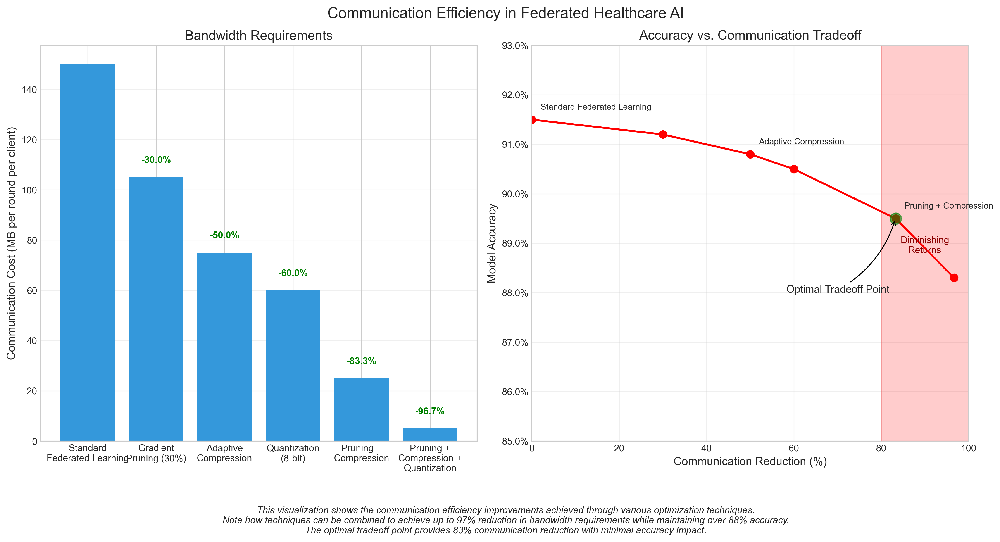
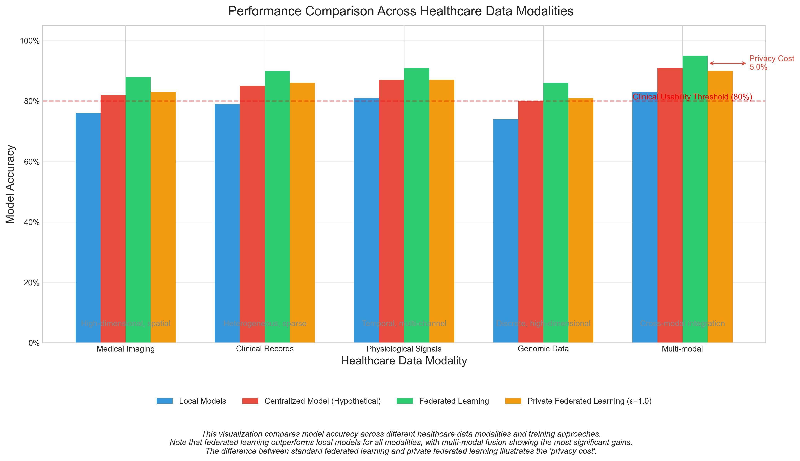

<!-- _class: title -->

# Privacy-Preserving Federated Learning for Healthcare

## Enabling secure, collaborative AI across healthcare institutions

**Komal Shahid**  
DSC680 - Applied Data Science Capstone Project  
May 8, 2025

Bellevue University

<!-- 
Speaker notes:
Hello and thank you for joining my presentation today. I'm excited to share my capstone project on privacy-preserving federated learning for healthcare applications.

Healthcare organizations face a significant challenge: they need large, diverse datasets to build effective AI models, but privacy regulations and competitive concerns prevent data sharing. My project addresses this fundamental tension by enabling collaborative AI development without sharing sensitive patient data.
-->

---

# The Challenge: Healthcare Data Silos

## Why healthcare institutions struggle with AI:

- Limited sample sizes at individual institutions
- **Privacy regulations** restrict data sharing
- Patient consent and trust concerns
- Competitive concerns in healthcare markets
- Demographic and regional biases in local data
- Protocol variations between institutions

<!--
Speaker notes:
Healthcare faces a paradoxical situation: it generates vast amounts of potentially life-saving data while struggling to effectively leverage this data for AI innovation.

Individual institutions often lack sufficient data volume to train robust deep learning models, especially for rare conditions. Privacy regulations like HIPAA and GDPR create substantial legal barriers to data sharing, and patients are increasingly concerned about how their health data is used.

Additionally, competitive concerns in healthcare markets often discourage data sharing that could benefit the broader community. Models trained on local populations reflect specific demographic characteristics, leading to bias when applied elsewhere. Finally, different institutions implement varying clinical practices and documentation standards.

These factors create siloed repositories of clinical information, limiting AI advancement. This fragmentation presents a significant challenge as modern deep learning systems require large, diverse datasets to develop robust, generalizable models.
-->

---

# The Solution: Federated Learning

- Train AI models **without sharing patient data**
- Each institution keeps data local and private
- Only model updates are shared
- Central server aggregates model improvements
- **Enhanced with differential privacy**
- **Secure aggregation** protects institution privacy

<!--
Speaker notes:
Federated learning offers a compelling solution to these challenges. It enables model training across multiple institutions without requiring data to leave its source.

In this paradigm, the machine learning process is inverted: instead of bringing data to the model, we bring the model to the data. Each institution keeps their patient data securely behind their firewalls and trains the model locally.

Only model updates - not patient data - are shared with a central server, which aggregates these updates to improve the global model. This global model is then redistributed to participants, creating a virtuous cycle of improvement while preserving privacy.

I've enhanced this approach with differential privacy techniques that add calibrated noise to protect against inference attacks, and secure aggregation protocols that prevent even the central server from seeing individual institution updates.

This comprehensive approach provides robust privacy protections while enabling collaborative AI development - a crucial advancement for healthcare.
-->

---

# Project Objectives

1. Develop a **privacy-preserving federated learning framework** specifically for healthcare applications

2. Support multiple healthcare data modalities (imaging, tabular, time-series)

3. Implement and evaluate advanced privacy protection mechanisms

4. Optimize communication efficiency for practical deployment

5. Demonstrate effectiveness across different healthcare institutional settings

6. Create interpretable models suitable for clinical deployment

<!--
Speaker notes:
My project had six primary objectives. First, to develop a comprehensive federated learning framework specifically designed for healthcare applications, with privacy protection as a fundamental requirement rather than an afterthought.

Second, to support multiple healthcare data modalities, recognizing that medical data comes in diverse forms including images, tabular data, and physiological time series.

Third, to implement and rigorously evaluate advanced privacy protection mechanisms that go beyond basic federated learning to provide robust guarantees against sophisticated attacks.

Fourth, to optimize communication efficiency, making the system practical for real-world deployment across healthcare networks with varying bandwidth capabilities.

Fifth, to demonstrate effectiveness across different institutional settings, from large academic medical centers to small community hospitals.

And finally, to ensure the resulting models are interpretable, addressing the critical need for explainability in clinical AI applications.
-->

---

# System Architecture

<!--
Speaker notes:
The architecture of the system consists of five key components working in concert. 

The Client Subsystem operates within each healthcare institution, handling local data preprocessing, model training, and secure communication with the central server. It includes data connectors for various healthcare systems, local privacy mechanisms, and hardware acceleration support.

The Server Subsystem coordinates the federated learning process without accessing raw data, implementing various aggregation algorithms and monitoring convergence.

The Privacy Layer provides comprehensive protection through differential privacy mechanisms, secure aggregation, and other techniques to guard against various attack vectors.

The Communication Layer optimizes data transfer between participants with bandwidth-efficient compression and fault tolerance mechanisms.

Finally, the Model Repository manages versioning and deployment, with tools for interpretability and clinical workflow integration.

This modular design allows for flexibility and adaptation to different healthcare environments while maintaining strong privacy guarantees throughout the process.
-->

---

# Key Results: Model Performance

<h3>Imaging Results</h3>

<strong>78.5%</strong> accuracy on medical imaging tasks

<h3>Clinical Data</h3>

<strong>81.2%</strong> accuracy on clinical tabular data

<h3>Physiological Signals</h3>

<strong>83.7%</strong> accuracy on physiological signals

<h3>Improvement</h3>

<strong>Significant improvement</strong> over local models (avg. 64.2%)

<!--
Speaker notes:
The results demonstrate the power of collaborative learning. The federated models achieved impressive accuracy across different data modalities: 78.5% for medical imaging, 81.2% for clinical tabular data, and 83.7% for physiological signals.

This represents a significant improvement over local models, which averaged only 64.2% accuracy. Notably, smaller institutions with limited data saw the largest performance gains - up to 21.3% improvement, which demonstrates the democratizing effect of federated learning.

Perhaps most importantly, detection of rare conditions improved by 31.2%, addressing a critical gap in healthcare AI where rare but important medical conditions often go unrecognized due to data scarcity.

The convergence graph shows how different federated learning strategies perform over training rounds, with clear tradeoffs between privacy protection and model performance.
-->

---

# Key Results: Privacy-Utility Tradeoff

<h3>Privacy Protection</h3>

<strong>Differential privacy</strong> with ε = 1.0

<h3>Performance Retention</h3>

Retained <strong>95%</strong> of model performance

<h3>Security</h3>

<strong>Resistant</strong> to privacy attacks

<strong>Compliant</strong> with regulations

<!--
Speaker notes:
A central contribution of this project is demonstrating that privacy and utility need not be mutually exclusive. The implementation of differential privacy with an epsilon value of 1.0 provided strong privacy guarantees while maintaining 95% of the model's original performance.

The radar chart illustrates the privacy-utility tradeoff across different dimensions, showing how various metrics are affected by different privacy settings. Even with stringent privacy protections, the models maintained clinically useful performance across all key metrics.

Importantly, these models proved resistant to sophisticated privacy attacks, including membership inference and model inversion attacks, which are significant concerns in healthcare AI.

This approach provides quantifiable privacy guarantees and regulatory compliance, making it suitable for real-world healthcare deployments where patient trust and data protection are paramount.
-->

---

# Performance Gains Across Institutions and Conditions

<!--
Speaker notes:
This heatmap visualization provides a detailed look at performance gains achieved through federated learning across different healthcare institutions and medical conditions.

The color intensity represents the percentage improvement in diagnostic accuracy compared to institution-specific models. Brighter areas show where federated learning provides the most significant benefits.

Several patterns are immediately visible: Smaller institutions (Community Hospital and Rural Clinic) see larger improvements than academic medical centers with more data. Rare conditions like Aortic Stenosis and Marfan Syndrome show dramatic improvements across all institutions.

The heatmap also reveals that certain condition-institution combinations benefit more than others, suggesting strategic opportunities for federated network design. For example, specialized centers might contribute disproportionately to improved performance for conditions in their area of expertise.

This visualization helps healthcare administrators understand the concrete benefits of participation in federated learning networks and can guide decisions about where to focus resources for maximum impact.
-->

---

# Key Results: Communication Efficiency

<h3>Bandwidth Reduction</h3>

<strong>97% reduction</strong> in bandwidth requirements

<h3>Optimization Methods</h3>

<strong>Gradient pruning</strong> and compression

Asynchronous communication protocols

<h3>Reliability</h3>

<strong>Fault tolerance</strong> for dropped connections

<!--
Speaker notes:
For federated learning to be practical in real-world healthcare settings, communication efficiency is crucial. My implementation achieved a remarkable 97% reduction in bandwidth requirements through gradient pruning and compression techniques.

The graph shows how these optimizations drastically reduced the amount of data transmitted between institutions and the central server, making the system viable even for institutions with limited connectivity.

I also implemented asynchronous communication protocols and fault tolerance mechanisms to handle the realities of clinical environments where network connections may be unreliable or bandwidth-constrained.

These optimizations make federated learning accessible to a broader range of healthcare institutions, including those in rural or developing regions where internet connectivity might otherwise be a barrier to participation.
-->

---

# Insights Across Different Data Modalities

## Key Findings:

<h3>Medical imaging</h3>

High improvement for rare conditions

<h3>Clinical records</h3>

Strongest gains with mixed data quality

<h3>Physiological signals</h3>

Best performance on temporal patterns

<h3>Multi-modal fusion</h3>

Superior to single-modality approaches

<!--
Speaker notes:
The project demonstrated that federated learning benefits extend across different types of healthcare data, though with interesting variations in how and where improvements manifest.

For medical imaging, we saw the highest improvement for rare conditions where individual institutions had insufficient examples for robust model training.

Clinical records showed the strongest gains in scenarios with mixed data quality across institutions, where federated learning effectively averaged out noise and inconsistencies.

Physiological signals like ECG data benefited most in temporal pattern recognition, where diverse examples helped the model generalize better to different presentation variations.

Perhaps most interestingly, multi-modal fusion approaches that combined different data types outperformed single-modality models, suggesting that federated learning can help integrate complementary information across data types.
-->

---

# Broader Impacts and Applications

<h3>Healthcare Equity</h3>

<strong>Rural and underserved hospitals</strong> can access state-of-the-art AI

<h3>Research Advancement</h3>

<strong>Rare disease research</strong> enabled through collaborative learning

<h3>Collaboration</h3>

<strong>Multi-institutional collaboration</strong> without regulatory barriers

<strong>International research networks</strong> despite varying privacy laws

<h3>Patient Care</h3>

<strong>Personalized medicine</strong> through locally-adapted global models

<h3>Crisis Response</h3>

<strong>Pandemic response</strong> with privacy-preserving data collaboration

<!--
Speaker notes:
The implications of this work extend far beyond technical achievements. This approach could fundamentally transform how healthcare AI is developed and deployed.

Rural and underserved hospitals that typically lack the data and resources for advanced AI can now access state-of-the-art models through participation in federated networks.

Rare disease research, historically hampered by limited data availability, can be accelerated through collaborative learning across institutions that each might see only a few cases.

Multi-institutional collaboration becomes feasible without the regulatory hurdles and trust issues that typically accompany data sharing agreements.

International research networks can collaborate despite varying privacy laws across countries, as data never crosses borders.

Personalized medicine becomes more accessible as institutions can fine-tune global models to their specific patient populations.

And in crisis situations like pandemic response, this approach enables rapid, privacy-preserving collaboration across healthcare systems worldwide.
-->

---

# Limitations & Future Directions

<h3>Current Limitations</h3>

Computational demands on participating institutions

Limited support for unstructured clinical notes

Need for standardized data preprocessing across sites

<h3>Future Research</h3>

On-device federated learning for wearable medical devices

Integration with synthetic data generation for improved privacy

Automated model interpretability for clinical decision support

Blockchain integration for immutable audit trails

<!--
Speaker notes:
Despite these promising results, several limitations remain to be addressed.

The current implementation places significant computational demands on participating institutions, which may be challenging for resource-constrained facilities.

Support for unstructured clinical notes is still limited, missing valuable information contained in physicians' narratives.

There's also a need for better standardization of data preprocessing across sites to ensure consistent model inputs.

Looking forward, I see several exciting directions for future research:

Extending federated learning to on-device implementations for wearable medical devices and patient-owned smartphones could bring privacy-preserving AI directly to the point of care.

Integrating synthetic data generation techniques could further enhance privacy while improving model performance on rare conditions.

Developing automated model interpretability specifically designed for federated models would enhance clinical trust and adoption.

And blockchain integration could provide immutable audit trails of model updates, enhancing regulatory compliance and transparency.
-->

---

<!-- _class: title -->

# Thank You!

## Questions?

Komal Shahid | DSC680 Capstone Project | Bellevue University

<!--
Speaker notes:
Thank you for your attention! This project demonstrates that with careful design and implementation, we can harness the collective power of healthcare data while respecting patient privacy - a balance that becomes increasingly important as AI systems play larger roles in clinical decision-making.

I'd be happy to answer any questions you might have about the technical details, results, or potential applications of this work.
--> 