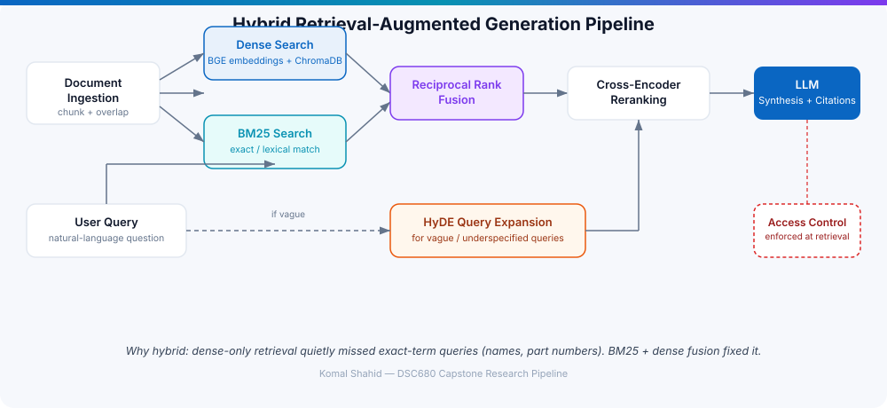
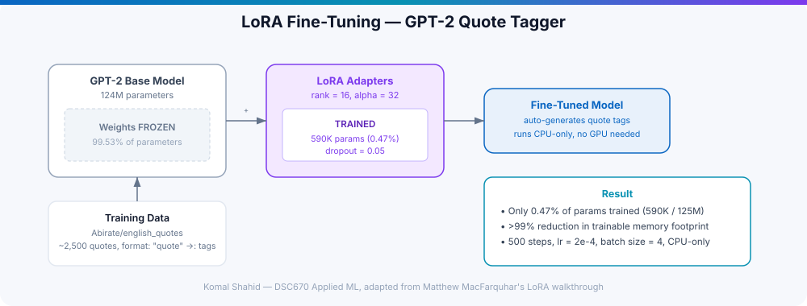

# Hybrid RAG & LLM Fine-Tuning Systems

**AI Systems Engineering | Retrieval-Augmented Generation + Parameter-Efficient Fine-Tuning**

## What This Is

Two connected systems built to answer the same question from different angles: **how do you make an LLM reliably grounded in real information, instead of trusting it to "just know"?**

1. A **hybrid retrieval-augmented generation (RAG) pipeline** that combines exact-match (BM25) and semantic (dense embedding) search, fuses them, and reranks the result before an LLM ever writes an answer.
2. A **LoRA fine-tuning pipeline** that adapts a base LLM to a narrow task efficiently — without needing a GPU or touching most of the model's weights.

Both were built the same way: try the naive version first, find where it actually breaks, then fix the specific failure mode instead of over-engineering upfront.

## System 1 — Hybrid RAG Pipeline

**The problem with dense-only retrieval:** semantic embeddings are great at matching meaning, and quietly bad at matching *exact* things — part numbers, names, specific phrasing. A pure vector-search RAG system will confidently retrieve the wrong passage for exactly the queries that matter most to a real user, and you won't notice until you build an adversarial eval set.

**Architecture:**
- **Ingestion** — documents are parsed and chunked with overlap so no fact gets cut in half at a chunk boundary
- **Dense search** — BGE embeddings indexed in ChromaDB
- **BM25 search** — classic lexical/exact-match retrieval, running in parallel
- **Reciprocal Rank Fusion** — combines both ranked lists into one, so neither retrieval mode's blind spot dominates
- **Cross-encoder reranking** — re-scores the fused top-k candidates for relevance before they reach the LLM
- **HyDE query expansion** — for vague/underspecified queries, generates a hypothetical answer first and searches with that, rather than the bare (often too-short) original query
- **LLM synthesis with citations** — the model answers only from retrieved passages, with attribution back to source document/page
- **Access control at the retrieval layer** — enforced before the LLM ever sees a document, not just at the UI

**Why it matters for deployment:** this is the architecture behind every "chat with your documents" enterprise product — Microsoft Copilot Studio's knowledge base grounding, Google's Vertex AI Search, and Anthropic's own RAG guidance all converge on some version of this pattern. Building it from scratch, and specifically finding the dense-only failure mode before fixing it, is the difference between knowing the term "hybrid search" and knowing why it exists.

`Python` `LangChain` `ChromaDB` `BGE Embeddings` `BM25` `Cross-Encoder Reranking` `HyDE` `Reciprocal Rank Fusion`

## System 2 — LoRA Fine-Tuning (GPT-2 Quote Tagger)

**The constraint:** fine-tune GPT-2 (124M parameters) to auto-generate tags for quotes, on a laptop with no GPU, in a fixed timeframe.

**The approach — Low-Rank Adaptation (LoRA):**
- Freeze the base model's weights entirely — don't touch the 124M pretrained parameters
- Insert small trainable adapter matrices into each layer (rank = 16, alpha = 32, dropout = 0.05)
- Train only the adapters: **590K parameters out of 125M — 0.47% of the model**
- Result: **>99% reduction in trainable memory footprint**, making CPU-only fine-tuning realistic
- Data formatting trick: structure training examples as `"quote" ->: tag1, tag2, tag3` so the model learns the separator marks a hard task switch from reading to generating tags
- Trained on `Abirate/english_quotes` (~2,500 quotes) from Hugging Face — 500 steps, learning rate 2e-4, batch size 4

**Why it matters for deployment:** this is exactly the tradeoff an enterprise customer faces when deciding between calling a large hosted model API versus fine-tuning something smaller and self-hosted. Data privacy (nothing leaves the local environment), cost (no GPU cluster required), and speed of iteration all favor the smaller, parameter-efficient approach for narrow, well-defined tasks — which is a real judgment call, not a theoretical one, once you've made it yourself under a real hardware constraint.

`PyTorch` `Hugging Face Transformers` `LoRA (PEFT)` `GPT-2` `OpenAI Fine-Tuning API`

## The Common Thread

Neither system was built by reaching for the biggest available model or the most impressive-sounding architecture. Both started simple, got stress-tested against real failure modes (a dense-only retriever missing exact matches; a full fine-tune being unnecessary and unaffordable for a narrow task), and only added complexity where the evidence showed it was needed. That's the same instinct behind every capstone project in this portfolio — see the [full portfolio](../../README.md) for the mental health prediction model, content strategy engine, and computer vision work built the same way.

[← Back to Portfolio](../../README.md)
